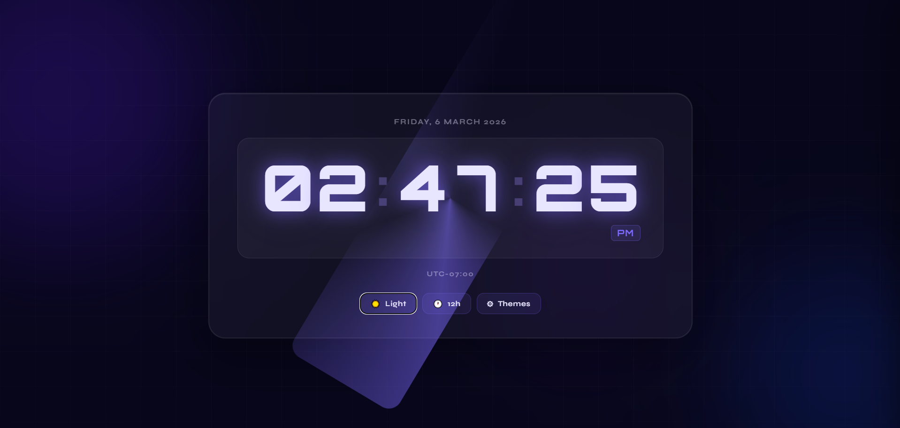
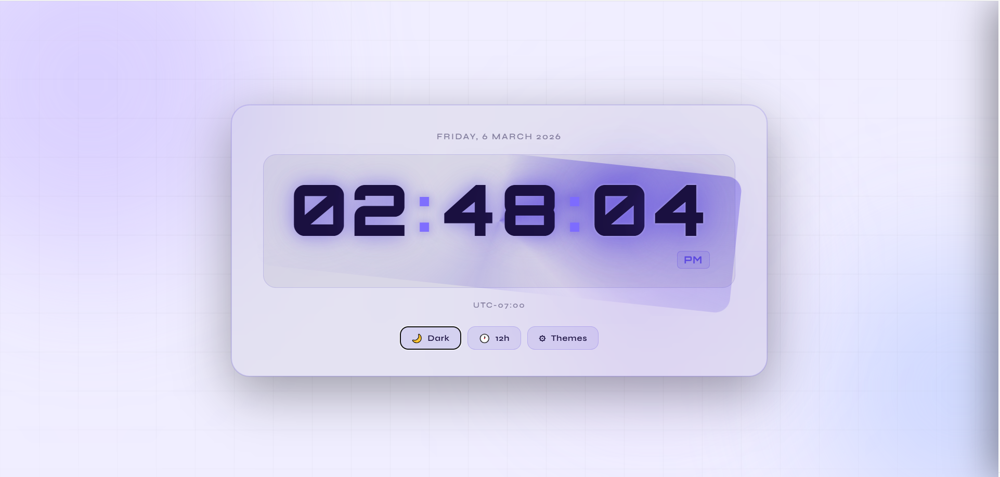
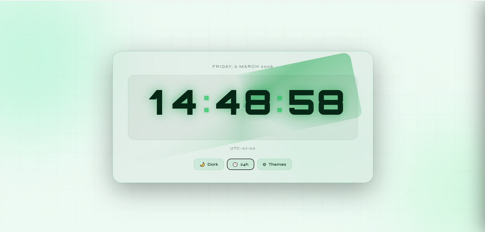
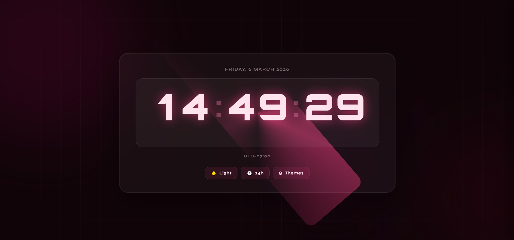

# ⏰ Digital Clock with Theme Switcher

A modern, responsive digital clock web app built with pure **HTML5**, **CSS3**, and **Vanilla JavaScript** — no frameworks, no libraries, no dependencies.

---

## 📸 Demo Screenshots

> _Add your screenshots here_

| Dark Mode | Light Mode |
|-----------|------------|
|  |  |

| Theme: Emerald | Theme: Rose |
|----------------|-------------|
|  |  |

---

## ✨ Features

- 🕐 **Real-time clock** — updates every second with smooth digit rendering
- 🔢 **Fixed-width digits** — no layout shift as numbers change
- 🌓 **12h / 24h toggle** — switch formats instantly
- 🎨 **7 color themes** — Violet, Emerald, Amber, Rose, Cyan (dark & light variants)
- ⚙️ **Settings panel** — slide-in gear drawer to pick themes and format
- ☀️🌙 **Dark / Light toggle** — one-click flip between dark and light for current palette
- 💾 **Persistent preferences** — theme and format saved in `localStorage`
- 📅 **Date display** — full weekday, date, month, year
- 🌍 **Timezone label** — auto-detected UTC offset
- 🌊 **Animated background** — floating orbs + subtle grid (CSS-only)
- 💫 **Glow ring** — rotating conic gradient around the clock face
- ⚡ **Seconds pulse** — per-tick glow flash on the seconds segment
- 💡 **Colon blink** — scale + opacity pulse synced to each second
- 📱 **Fully responsive** — works on desktop, tablet, and mobile

---

## 🎨 Themes

| Theme | Dark | Light |
|-------|------|-------|
| Violet | ✅ | ✅ |
| Emerald | ✅ | ✅ |
| Amber | ✅ | — |
| Rose | ✅ | — |
| Cyan | ✅ | — |

---

## 🚀 Getting Started

No build step. No install. Just open the file.

```bash
https://github.com/malikarslanasif131/Digital-Clock-with-Theme-Switcher.git
cd Digital-Clock-with-Theme-Switcher
open index.html
```

Or drag `index.html` into any browser.

---

## 📁 File Structure

```
Digital-Clock-with-Theme-Switcher/
├── index.html       # Markup & layout
├── style.css        # All themes, animations, responsive styles
├── script.js        # Clock logic, theme engine, settings panel
└── screenshots/     # Add your demo images here
    ├── dark.png
    ├── light.png
    ├── emerald.png
    └── rose.png
```

---

## 🛠️ Tech Stack

| Layer | Technology |
|-------|------------|
| Structure | HTML5 |
| Styling | CSS3 (custom properties, animations, flexbox) |
| Logic | Vanilla JavaScript ES6+ |
| Fonts | [Orbitron](https://fonts.google.com/specimen/Orbitron) + [Syne](https://fonts.google.com/specimen/Syne) via Google Fonts |

---

## 📐 How It Works

### Fixed-Width Digits
Each `HH`, `MM`, `SS` pair lives inside a `seg-cell` with `width: 2.05ch` and `font-variant-numeric: tabular-nums`. Digits are updated via individual `<span>` elements — the container never resizes.

### Theme System
Themes are defined as CSS custom property sets on `[data-theme="..."]` attribute selectors. JavaScript swaps the attribute on `<html>` and persists the choice to `localStorage`.

### Settings Panel
A slide-in drawer (CSS `translateX` transition) lets users pick from all 7 themes with live swatches and toggle the time format via a pill switch.

---

## 🤝 Contributing

Pull requests are welcome! To add a new theme:

1. Add a `[data-theme="your-theme"]` block in `style.css` with the required CSS variables
2. Register it in the `THEMES` array in `script.js`
3. Open a PR with a screenshot

---

## 📄 License

[MIT](LICENSE) — free to use, modify, and distribute.

---

<p align="center">Made with ❤️ using HTML · CSS · JavaScript</p>
